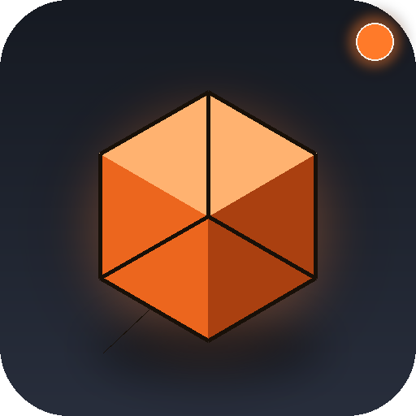

<h1 align="center">OllamaToBlender</h1>

<p align="center">
  
</p>

<p align="center">
  <b>Pilote Blender depuis un LLM 100&nbsp;% local</b> — sans Claude, sans OpenAI, sans clé d'API.<br/>
  Pipeline&nbsp;:  prompt en langage naturel → Ollama → script <code>bpy</code> → addon TCP <code>blender-mcp-addon</code> (port 9876).
</p>

<p align="center">
  <a href="https://github.com/Oli97430/OllamaToBlender/releases/latest"></a>
  
  
  
</p>

OllamaToBlender remplace le client (Claude Cowork / Claude Code) du projet [`Oli97430/blender-mcp-addon`](https://github.com/Oli97430/blender-mcp-addon) par un client **100&nbsp;% local** avec une interface moderne, un installateur d'addon en un clic, et toute une chaîne de fiabilité (lint, auto-fix, vision, render preview).

---

## Sommaire

- [Aperçu](#aperçu)
- [Fonctionnalités](#fonctionnalités)
- [Installation rapide](#installation-rapide)
  - [Option A — Exécutable Windows (zéro Python)](#option-a--exécutable-windows-zéro-python)
  - [Option B — Source (Windows / macOS / Linux)](#option-b--source-windows--macos--linux)
- [Premier lancement](#premier-lancement)
- [Modèles recommandés (Q4_K_M)](#modèles-recommandés-q4_k_m)
- [Architecture](#architecture)
- [Raccourcis clavier](#raccourcis-clavier)
- [Réglages avancés](#réglages-avancés)
- [Fichiers utilisateur](#fichiers-utilisateur)
- [Troubleshooting](#troubleshooting)
- [Build & release (mainteneurs)](#build--release-mainteneurs)
- [Licence](#licence)

---

## Aperçu

| | |
|---|---|
| **Sans cloud** | Tout tourne en local : pas de prompt envoyé à un serveur tiers, pas de quota, pas de clé d'API. |
| **Sans installer manuellement le addon** | L'app détecte tes installations Blender et copie le `blender_mcp_addon.py` au bon endroit en un clic. |
| **Auto-fix sur erreur** | Si Blender renvoie une exception, l'app re-soumet le code au modèle avec la traceback pour qu'il le corrige tout seul. |
| **Render preview** | Toggle "Preview" : après chaque exécution, l'addon rend le viewport et l'app affiche la PNG inline. |
| **Routing intelligent** | "List all materials" → prompt court (lecture seule). "Build a forest" → prompt complet (création). |
| **Vision** | Quand un modèle vision-capable est sélectionné (`llava`, `qwen2.5-vl`, …), un bouton 📎 apparaît pour attacher une image de référence au prompt. |
| **Coloration syntaxique** | `pygments` colore le code généré directement dans la fenêtre, et tu peux l'éditer avant `Run in Blender`. |

---

## Fonctionnalités

### Setup & onboarding
- **Installateur d'addon intégré** : détecte automatiquement `%APPDATA%\Blender Foundation\Blender\<X.Y>\scripts\addons` (Windows), `~/Library/Application Support/Blender/...` (macOS), `~/.config/blender/...` (Linux + Snap + Flatpak). Source : GitHub Releases en direct, fallback bundle hors-ligne.
- **Manage models** : list, switch, et `ollama pull` avec barre de progression.
- **Status pills** temps réel pour Ollama et Blender, cliquables pour forcer un refresh.
- **Update check** silencieux au démarrage (GitHub Releases). Toast si nouvelle version.

### Chat & génération
- Streaming token par token, **bouton Stop** + `Esc` pour interrompre.
- **Code éditable** : tu peux ajuster le script avant de l'envoyer à Blender.
- **Auto-run** optionnel : exécution immédiate après streaming.
- **Auto-fix** : sur erreur, re-prompt automatique avec la traceback (configurable, max 1 tentative par défaut).
- **Lint AST** avant envoi : les erreurs de syntaxe sont attrapées sans round-trip Blender.
- **Preview viewport** inline (toggle).
- **Stats par turn** : tokens, durée, tokens/s.
- **Save .py** par turn, **Export** de la conversation entière en JSON.
- **Régénération** d'un turn (`↻`).
- **Historique persistant** entre sessions (auto, `~/.ollamatoblender/history.json`).
- **Trimming d'historique** : au-delà du budget de tokens, les vieux turns sont automatiquement droppés.
- **Routing dynamique** du system prompt (query vs build).
- **Vision** (Ollama natif) : attache une image, elle part avec le prompt en base64.
- **Timestamp** par turn.

### Robustesse côté Blender
- **Wrap automatique en `temp_override` VIEW_3D** complet (window + screen + area + region + scene + view_layer) → plus d'erreurs `Operator … context is incorrect`.
- **Reset best-effort en mode `OBJECT`** avant exécution (évite les `select_all.poll() failed` quand un script précédent a laissé la scène en mode édition).
- **Postamble render** opt-in qui capture le viewport, encode en base64, et stuffe le PNG dans `result["_otb_render"]`.

### Quality of life
- Tooltips partout, raccourcis clavier (`Ctrl+1..4`, `Ctrl+L`, `Ctrl+K`, `Ctrl+,`, `Esc`).
- Thème sombre / clair / système.
- Géométrie de fenêtre persistée.
- Vue **Logs** (fichier sur disque + viewer in-app).

---

## Installation rapide

### Option A — Exécutable Windows (zéro Python)

1. Télécharge `OllamaToBlender.exe` depuis la dernière [GitHub Release](https://github.com/Oli97430/OllamaToBlender/releases/latest).
2. Double-clique. Pas d'installateur, pas de venv, pas de Python à installer côté toi.

### Option B — Source (Windows / macOS / Linux)

```bash
git clone https://github.com/Oli97430/OllamaToBlender.git
cd OllamaToBlender
```

**Windows :**
```bat
run.bat
```

**macOS / Linux :**
```bash
chmod +x run.sh
./run.sh
```

`run.bat` / `run.sh` créent un venv, installent les dépendances et lancent l'app. Manuellement :

```bash
python -m venv .venv
# Windows: .venv\Scripts\activate
source .venv/bin/activate
pip install -r requirements.txt
python main.py
```

---

## Premier lancement

1. **Lance l'app** (`OllamaToBlender.exe` ou `python main.py`).
2. **Onglet Setup** → l'app détecte tes installations Blender. Choisis-en une, clique **Install / Update addon**.
3. **Démarre Ollama** : `ollama serve` (lancé automatiquement sur Windows / macOS).
4. **Onglet Models** → choisis `qwen2.5-coder:7b` puis **Pull model** (~4.7 GB, Q4_K_M, recommandé). Ou en CLI :
   ```bash
   ollama pull qwen2.5-coder:7b
   ```
5. **Dans Blender** : Edit → Preferences → Add-ons, cherche "MCP Server" et coche-le. La N-Panel du 3D Viewport montre les contrôles du serveur.
6. **Reviens à l'onglet Chat** : les deux pastilles (Ollama, Blender) doivent passer au vert.
7. Tape une requête, par exemple :

   > Build a stylised studio scene: a wood floor, a glass icosphere, and a 3-point lighting rig

---

## Modèles recommandés (Q4_K_M)

> **Q4_K_M** = quantization 4 bits, K-means, M = medium. C'est le compromis qualité / mémoire que `ollama pull <name>` choisit par défaut.

| Modèle | VRAM | Note |
|---|---|---|
| `qwen2.5-coder:7b` | ~5 GB | **Défaut** — meilleur rapport qualité/taille pour du code |
| `qwen2.5-coder:14b` | ~9 GB | Plus précis sur les requêtes complexes |
| `qwen2.5-coder:3b` | ~2 GB | GPU léger / CPU |
| `deepseek-coder-v2:16b` | ~9 GB | Alternative très solide |
| `codellama:13b` | ~7 GB | Le classique |
| `llama3.1:8b` | ~5 GB | Généraliste |
| `qwen2.5-vl:7b` *(vision)* | ~6 GB | Pour attacher des images au prompt |
| `llava:7b` *(vision)* | ~5 GB | Vision alternative |

L'onglet **Models** propose ces presets en un clic.

---

## Architecture

```
┌─────────────────┐   prompt    ┌────────────┐   bpy code    ┌──────────────────┐
│ OllamaToBlender │ ──────────► │   Ollama   │ ────────────► │ blender-mcp-addon│
│   (cette app)   │ ◄────────── │  (local)   │               │   (port 9876)    │
└─────────────────┘   tokens    └────────────┘               └──────────────────┘
        ▲                                                            │
        └──────────── stdout / result / render / error  ◄────────────┘
```

| Module | Rôle |
|---|---|
| `core/ollama_client.py` | Client HTTP streaming (`/api/chat`, `/api/pull`, `/api/tags`) + token budget + vision detection |
| `core/blender_client.py` | Client TCP du addon, wrap auto VIEW_3D + render postamble |
| `core/system_prompt.py` | Deux prompts (creator / query) + routeur d'intention |
| `core/lint.py` | Pré-flight `ast.parse` |
| `core/addon_installer.py` | Détection des dossiers Blender + download GitHub avec fallback bundle |
| `core/updater.py` | Check des releases GitHub |
| `core/settings.py` | Persistance JSON des réglages |
| `gui/app.py` | Fenêtre principale (sidebar + vues) |
| `gui/chat_turn.py` | Carte d'échange (prompt / streaming / code / résultat / preview) |
| `gui/widgets.py` | StatusPill, CodeView (avec coloration), Toast, Tooltip, InlineImage, IconButton |
| `gui/theme.py` | Tokens de design (couleurs, radii, fonts, scales) |
| `assets/blender_mcp_addon.py` | Bundle hors-ligne du addon |
| `assets/make_logo.py` | Génère logo PNG / ICO |

---

## Raccourcis clavier

| Action | Raccourci |
|---|---|
| Envoyer le prompt | `Ctrl+Enter` |
| Arrêter le streaming | `Esc` |
| Vider la conversation | `Ctrl+L` |
| Focus sur le prompt | `Ctrl+K` |
| Ouvrir Settings | `Ctrl+,` |
| Onglet Chat / Setup / Models / Logs | `Ctrl+1` / `Ctrl+2` / `Ctrl+3` / `Ctrl+4` |

---

## Réglages avancés

Onglet **Settings** :

| Section | Réglage |
|---|---|
| Ollama | Endpoint, température, keep-alive |
| Blender | Host, port, "Test connection" |
| Behaviour | Persist history, auto-route prompt, check for updates, max history tokens, auto-fix attempts |
| Appearance | Thème dark / light / system |

Toggles inline dans la barre de chat :
- **Auto-run** — exécute automatiquement le code après streaming
- **Auto-fix** — re-soumet sur erreur Blender
- **Preview** — rend le viewport après exécution

---

## Fichiers utilisateur

Tous stockés sous `~/.ollamatoblender/` :

```
~/.ollamatoblender/
├── settings.json     # réglages persistants
├── history.json      # conversation entre sessions (toggle)
└── events.log        # journal des évènements (vue Logs)
```

Aucune télémétrie. Aucun fichier en dehors de ce dossier.

---

## Troubleshooting

| Symptôme | Solution |
|---|---|
| Pastille **Ollama offline** | `ollama serve`, ou vérifier l'URL dans Settings. |
| Pastille **Blender offline** | Le addon n'est pas démarré. Onglet Setup → install. Sinon : Edit → Preferences → Add-ons → coche "MCP Server". |
| `Operator … context is incorrect` | Re-essaye : le wrap auto + le reset de mode devraient passer maintenant. Sinon, ouvre l'onglet Logs. |
| `KeyError: 'Principled BSDF' not found` | Le system prompt teach maintenant le pattern robuste. Régénère via `↻`. |
| Modèle qui hallucine sur l'API `bpy` | Préfère `qwen2.5-coder:7b` ou `:14b`. Les modèles non-code sont plus faibles. Baisse la température à 0.1. |
| L'app ne démarre pas | `python main.py` en console pour voir la traceback ; vérifier `pip install -r requirements.txt`. |
| Conversation trop longue / lente | Réduis `Max history tokens` dans Settings ou clique **Clear** (`Ctrl+L`). |

---

## Build & release (mainteneurs)

### Construire l'exe Windows

```bat
build.bat
```

Crée `dist\OllamaToBlender.exe` (single-file, windowed, icône Windows). Sous macOS / Linux :

```bash
./build.sh
```

### Publier une release

```bash
# Tag the release locally
git tag v1.0.0 && git push --tags

# Create the GitHub release with the exe attached
gh release create v1.0.0 dist/OllamaToBlender.exe \
    --title "OllamaToBlender v1.0.0" \
    --notes-file CHANGELOG.md
```

L'auto-update check de l'app interroge `https://api.github.com/repos/Oli97430/OllamaToBlender/releases/latest` et compare le `tag_name` avec `APP_VERSION` (dans `gui/app.py`). Si plus récent → toast + lien dans About.

---

## Licence

GPL-3.0-or-later — pour rester compatible avec l'addon Blender et l'écosystème upstream.
